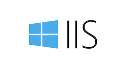
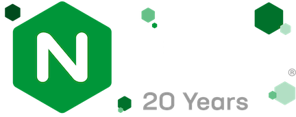
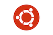

# Deliverable 1 Submission

## Basic Terminology

### What is a web server?

A web server on the hardware side is a computer that stores software and a websites component files. Web servers connect to a the internet and supports physical data exchanges with other devices on the web.

A web server on the software side includes parts that control how users access hosted files like an HTTP server. These servers understand urls and HTTP and can be accessed through the domain names of the websites it stores. The serves delivers these hosted websites to the end user’s device

## Examples of different web server applications:
 
| Web server name    | Date created: | Project's Website |
| :---:| :---: | :---:|
| Apache  | 1995-1996    | https://www.apache.org|
| IIS |  1995     | https://www.iis.net|
| Lighttpd    | 2003    | https://www.lighttpd.net| 
|NGINX|2002| https://nginx.org|

### What is Apache?

Apache is a free and open-source HTTP server for most modern operating systems like UNIX and windows made in 1995. The project is maintained and developed by volunteers worldwide.

### What is IIS?

IIS stands for Internet Information Services and is a Microsoft web server that runs on Windows operating system.

### What is Lightttpd?

lighttpd, as described on their website, is a secure, fast, compliant, and flexible web server that has lower resource use than other popular web servers.

### What is NGINX?

Written by Igor Sysoev, nginx is an HTTP web server, reverse proxy, content cache, load balancer, TCP/UDP proxy server, and mail proxy server.

## What is virtualization?

Virtualization uses software to create an abstraction layer over computer hardware, enabling the division of a single computer's hardware components—such as processors, memory and storage—into multiple virtual machines (VMs). Each VM runs its own operating system (OS) and behaves like an independent computer, even though it is running on just a portion of the actual underlying computer hardware.

## What is virtualbox?

VirtualBox is a general-purpose full virtualization software for modern hardware and be used on laptops, desktops, servers and for embedded use.

## What is a virtual machine?

A virtual machine is a computer file that behaves like an actual computer. It can run in a window partitioned from the rest of the system as a separate computing environment and can't interfere with the host computer's primary operating system. A virtual machine can run different operating systems from the host computer's primary operating system.

## What is Ubuntu Server?

Ubuntu Server is an open source project that is a version of the Ubuntu operating system designed and engineered as a backbone for the internet.

## What is a firewall?

A firewall is a network security device that monitors and controls incoming and outgoing network traffic to prevent unauthorized access. Firewalls can be hardware, software, or a combination of both

## What is SSH?

The Secure Shell (SSH) Protocol is a cryptographic network protocol for operating network services that allows users to securely access and manage remote computers and systems over an unsecured network:
