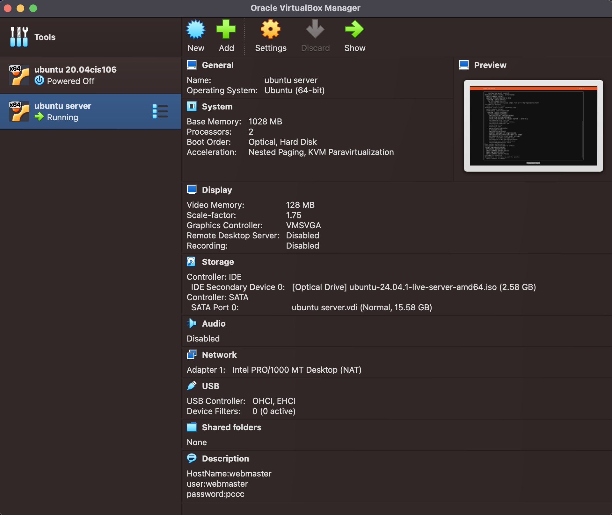

# Deliverable 2 Submission

## Server Specifications

## Ubuntu Login Screen

## Server Specifications

## Ubuntu Login Screen

## Questions
3. **What is the IP address of your Ubuntu Server Virtual Machine?**
   
4. **How do you enable the Ubuntu Firewall?**
	Use terminal command `sudo ufw enable`
   
5. **How do you check if the Ubuntu Firewall is running?**
   	Use terminal command `sudo ufw status`

6. **How do you disable the Ubuntu Firewall?**
   	Use terminal command `sudo ufw disable`

7. **How do you add Apache to the Firewall?** 
	Use terminal command `firewall-cmd --add-service http --permanent`

8. **What is the command you used to install Apache?**
         `sudo apt install apache2`

9.  **What is the command you use to check if Apache is running?**
    `sudo systemctl status apache2`

10. **What is the command you use to stop Apache?**
    `sudo systemctl stop apache2`

11. **What is the command you use to restart Apache?**
   	`sudo systemctl restart apache2`

12. **What is the command used to test Apache configuration?**
    	`apachectl configtest`

13. **What is the command used to check the installed version of Apache?**
    	`apachectl -v`

14. **What are the most common commands to troubleshoot Apache errors? Provide a brief description of each command.**
    	`sudo systemctl status apache2.service -l --no-pager`
	`sudo journalctl -u apache2.service --since today --no-pager`
	`sudo apachectl configtest`
	`sudo tail -n 2 /var/log/apache2/error.log`

15. **Which are Apache Log Files, and what are they used for? Provide examples and screenshots.**
	Apache logs are files the HTTP server populates with data like request and response information, server activity, errors, and other relevant data.