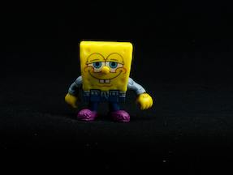

# SpongeBob Squarepants

**Senior fry cook at The Krusty Krab**

Seasoned Fry Cook with over 20+ years of experience in the restaurant industry. Proficient in preparing and cooking a variety of menu items, including burgers, fries, chicken, and more under high standards of quality and food safety. Able to handle multiple orders simultaneously and preform great in a team environment. 

# Experience

## The Krusty Krab
***Part time Krusty Krab employee • 2000 — 2024***

• 	Excelled in a fast-paced kitchen environment, 
• 	mastering fryer, grill, and other on-site stations during peak operations.
• 	Assisted in renovations and operations for 10+ residential properties
• 	374 consecutive employee of the month awards 

## The Chum Bucket employee
***Part time Chum bucket employee • 2001 — 2009***

## Pretty Patties
***Co-owner•, 2001***

• 	Maker of the idea, brand name, production of pretty patties and co owner of the business

# Education

## Ms.Puff Boating School
***Commercial boating license • 2004***

## Bikini Bottom High School
***High School Diploma • 2004***

•  Achieved Honor Roll for all four Year four years | 3.46 GPA.

## Mr Tentacle’s School of Art
***Associate illustration degree • 2005***

# Projects

## bikini bottom Orchestra
***Orchestral performer  • 2001 — Present***

•  Played in numerous well loved stadiums including the bubble bowl

# Skills

• 	Grilling		• 	Roasting
• 	Frying		    • 	Sautéing
• 	Deep Frying 	• 	steaming

# Recognition

## Golden Spatula Award
***The Fry Cook Games • 1998-2014***

• 	 98’-03’ and 04’-14’ holder of the Golden Spatula

## Most likely to become a celebrity chef
***Bikini Bottom High School • 2004***

• 	Voted Most Likely To Succeed by a panel of my high school peers.

# Associations

## Mermaid man and barnacle boy fan club
***Mermaid man and barnacle boy fan club member • 2001***

## Science scouts 
***Science scouts club member • 2020***