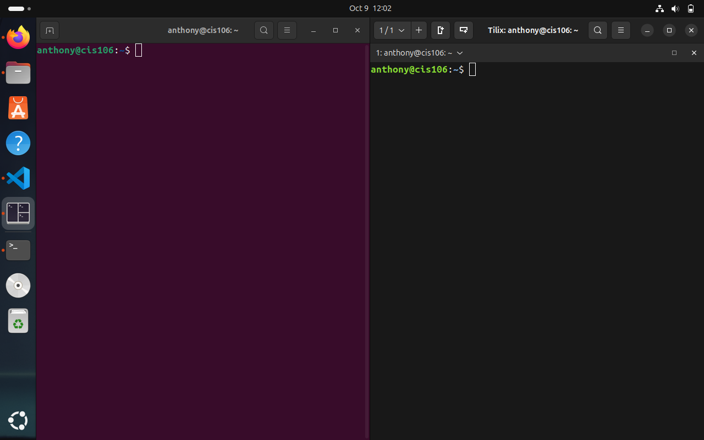
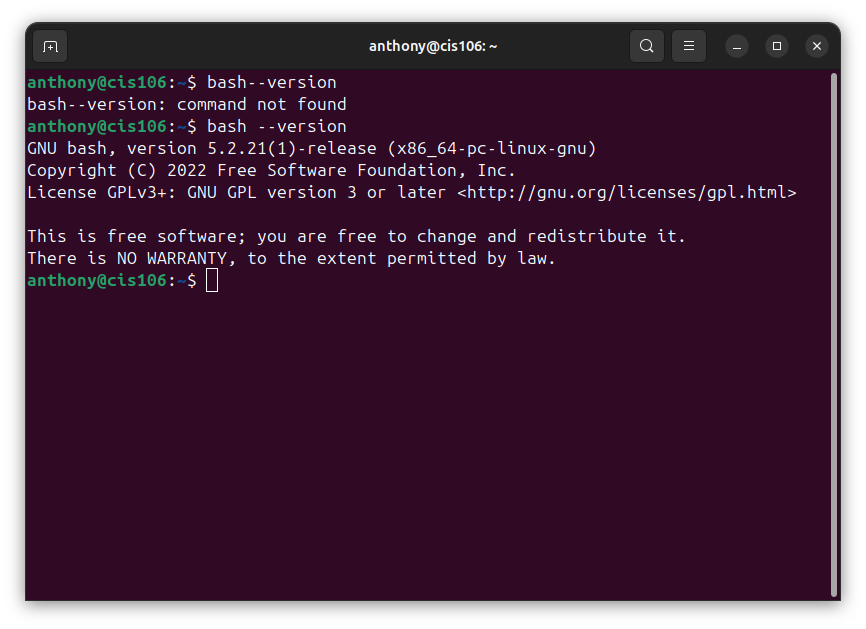
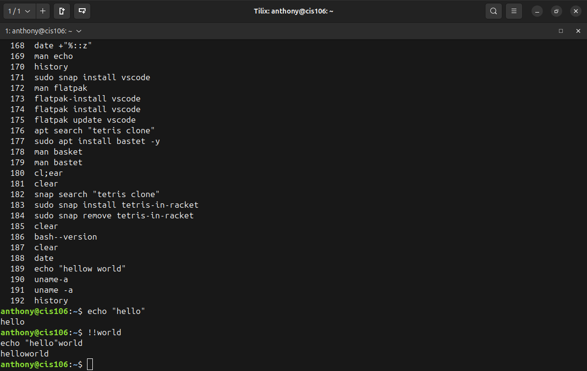
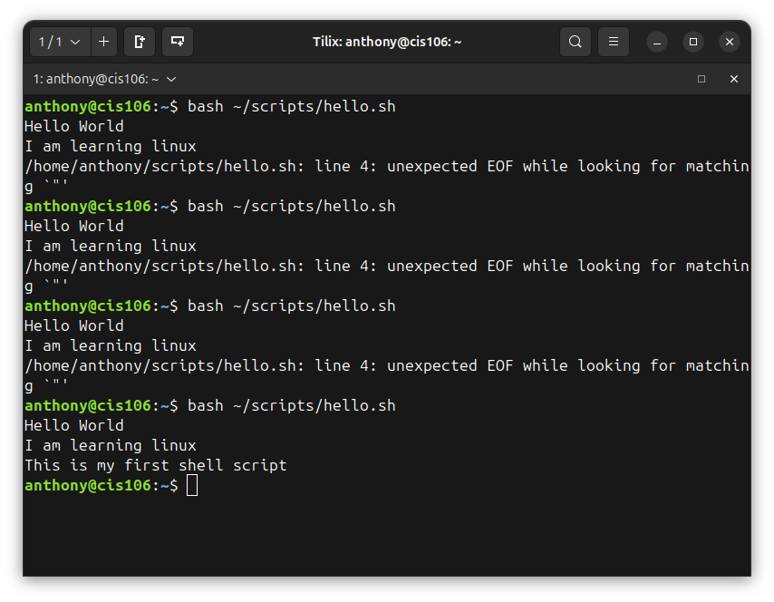
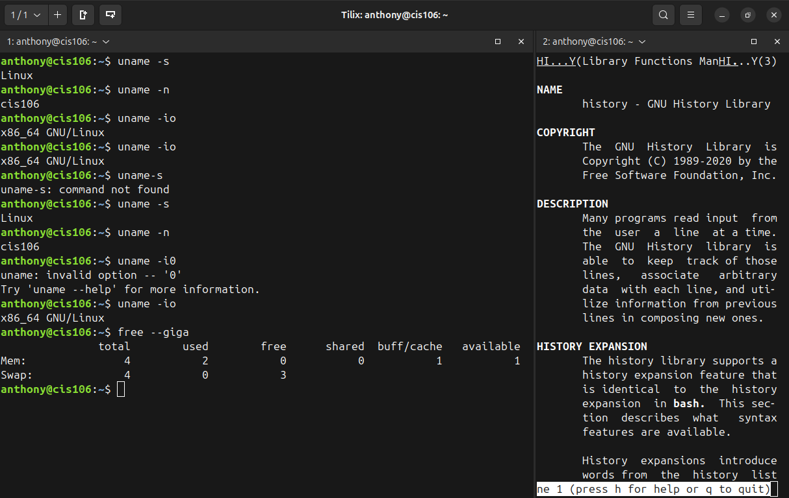
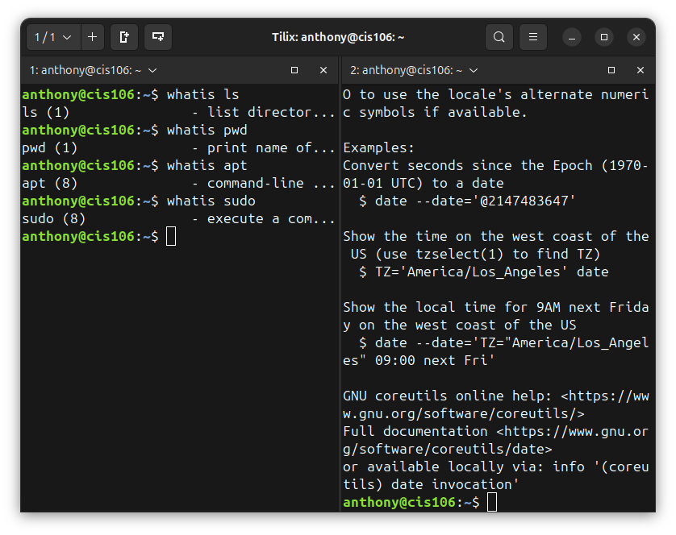
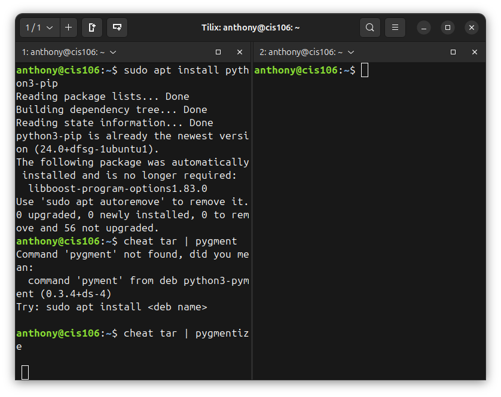
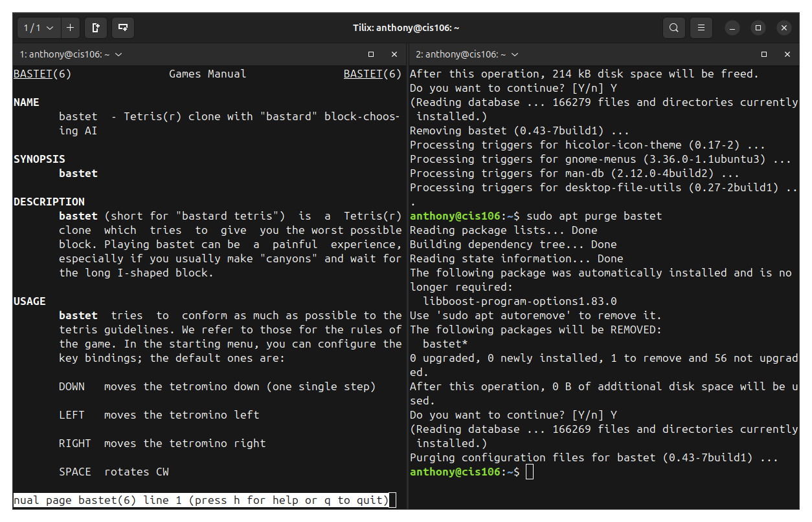
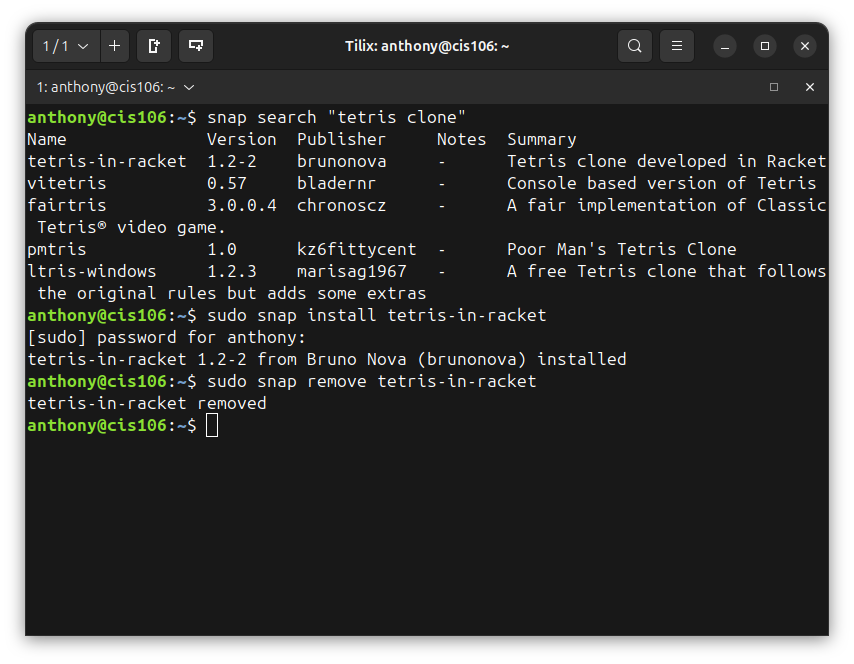

# Week Report 3
## Completed work for week 3
+ [lab3.md](https://github.com/Anthony-C-Rosario/cis106/blob/main/labs/lab3/lab3.md)
+ [notes3](https://github.com/Anthony-C-Rosario/cis106/blob/main/notes/notes3/notes3.md)

## Practice

### Practice 1

    ### Practice 2
        
    ### Practice 3
        
    ### Practice 4
        
    ### Practice 5
        
    ### Practice 6
        
    ### Practice 7
        
    ### Practice 1 - Managing Software
        
    ### Practice 3 - Managing Software
        
